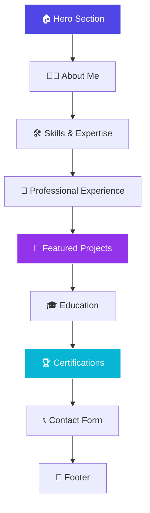

# Taran Mamidala | Portfolio Website

<div align="center">


<p align="center">
  <a href="https://taran-dev4u.io" target="_blank">
    
  </a>
  <a href="mailto:mtaran014@gmail.com">
    
  </a>
  <a href="https://www.linkedin.com/in/taranmamidala/" target="_blank">
    
  </a>
</p>

<p align="center">
  
  
  
  
  
  
</p>

<p align="center">
  <strong>🚀 A cutting-edge, fully responsive portfolio website showcasing my journey as a Data Analyst, Data Scientist, and Software Developer</strong>
</p>

</div>

---

## ✨ Features

<table>
<tr>
<td width="50%">

### 🎨 **Design & UX**
- 🌙 **Modern Dark Theme** with glassmorphism effects
- ⚡ **Smooth Animations** powered by Framer Motion
- 📱 **Fully Responsive** across all devices
- 🎯 **Interactive Navigation** with smooth scrolling
- 💫 **Dynamic Typewriter** effect in hero section
- 🏆 **Professional Timeline** for experience showcase

</td>
<td width="50%">

### 🛠️ **Technical Excellence**
- ⚛️ **React 18** with TypeScript for type safety
- 🎨 **Tailwind CSS** with custom design system
- 🚀 **Vite** for blazing-fast development
- 📊 **Dynamic CSV Integration** for certifications
- 🔍 **SEO Optimized** with meta tags and structured data
- 🎭 **Performance Optimized** animations and loading

</td>
</tr>
</table>

---

## 🏗️ Architecture & Sections



### 📋 **Portfolio Sections**

| Section | Description | Highlights |
|---------|-------------|------------|
| **🏠 Hero** | Engaging introduction with typewriter effect | Dynamic roles, contact info, CTA buttons |
| **👨‍💻 About** | Professional summary and expertise | Key strengths, role alignment |
| **🛠️ Skills** | Technical competencies organized by category | Languages, frameworks, tools, cloud |
| **💼 Experience** | Interactive timeline of professional journey | Expandable cards, achievements, tech stack |
| **🚀 Projects** | Showcase of featured work with live demos | Filtering, hover effects, tech tags |
| **🎓 Education** | Academic background and achievements | Degrees, institutions, coursework |
| **🏆 Certifications** | Professional certifications from CSV data | Dynamic loading, external links |
| **📞 Contact** | Contact form and social connections | EmailJS integration, social links |

---

## 🚀 Quick Start

### Prerequisites
Before you begin, ensure you have the following installed:
- **Node.js** (v18 or higher)
- **npm** or **bun** package manager
- **Git** for version control

### 📦 Installation

```bash
# Clone the repository
git clone https://github.com/taran-dev4u/dineshbarri-portfolio.git

# Navigate to project directory
cd dineshbarri-portfolio

# Install dependencies
npm install
# or
bun install

# Start development server
npm run dev
# or
bun run dev
```

### 🌐 Development Server
Open [http://localhost:8080](http://localhost:8080) in your browser to see the result.

### 🏗️ Build for Production

```bash
# Create optimized production build
npm run build

# Preview production build locally
npm run preview
```

---

## 📁 Project Structure

```bash
dineshbarri-portfolio/
├── 📂 public/
│   ├── 📜 Certifications.csv          # Certification data source
│   ├── 🖼️ project-*.png              # Project screenshots
│   ├── 🏢 logos/                     # Certification authority logos
│   ├── 📄 Taran_Resume.pdf           # Resume document
│   └── 🤖 robots.txt                 # SEO robots configuration
├── 📂 src/
│   ├── 📂 components/
│   │   ├── 🎨 ui/                    # shadcn/ui components
│   │   ├── 🏠 Hero.tsx               # Hero section
│   │   ├── 👨‍💻 About.tsx            # About section
│   │   ├── 🛠️ Skills.tsx            # Skills showcase
│   │   ├── 💼 Experience.tsx         # Timeline experience
│   │   ├── 🚀 Projects.tsx           # Projects gallery
│   │   ├── 🎓 Education.tsx          # Education cards
│   │   ├── 🏆 Certifications.tsx     # Dynamic certifications
│   │   ├── 📞 Contact.tsx            # Contact form
│   │   └── 🔗 Footer.tsx             # Footer section
│   ├── 📂 hooks/                     # Custom React hooks
│   ├── 📂 lib/                       # Utility functions
│   ├── 📂 pages/                     # Page components
│   ├── 🎨 index.css                  # Global styles & design system
│   ├── ⚛️ App.tsx                    # Main app component
│   └── 🚀 main.tsx                   # Application entry point
├── ⚙️ tailwind.config.ts            # Tailwind configuration
├── ⚡ vite.config.ts                # Vite configuration
└── 📦 package.json                  # Dependencies and scripts
```

---

## 🎨 Design System

### Color Palette
```css
Primary:   HSL(217, 91%, 60%)  /* Blue */
Accent:    HSL(280, 87%, 65%)  /* Purple */
Background:HSL(222, 84%, 5%)   /* Dark */
Glass:     rgba(255, 255, 255, 0.05) /* Glassmorphism */
```

### Typography
- **Display Font**: Sora (headings)
- **Body Font**: Inter (content)
- **Code Font**: Monospace for technical elements

### Animation Principles
- **Smooth entrances** with staggered delays
- **Micro-interactions** on hover and focus
- **Performance-optimized** transforms and opacity
- **Reduced motion** support for accessibility

---

## 🛠️ Tech Stack Deep Dive

### Frontend Core
```javascript
React 18           // Modern component architecture
TypeScript         // Type-safe development
Vite              // Lightning-fast build tool
React Router      // Client-side routing
```

### Styling & Animation
```css
Tailwind CSS      // Utility-first CSS framework
Framer Motion     // Advanced animations
shadcn/ui         // Beautiful, accessible components
Custom CSS        // Glassmorphism and design system
```

### Development Tools
```bash
ESLint            # Code linting
PostCSS           # CSS processing
TypeScript        # Static type checking
Lovable Tagger    # Development tooling
```

### Integrations
```javascript
EmailJS           // Contact form functionality
TanStack Query    // State management
CSV Parsing       // Dynamic certification loading
Structured Data   // SEO optimization
```

---

## 📊 Featured Projects Showcase

<div align="center">

### 🚀 **Project Categories**

| Category | Projects | Technologies |
|----------|----------|--------------|
| **🌐 Web Development** | Campus Recruitment System, Digital Signature Tool | Django, React, Node.js |
| **🤖 AI & Automation** | AI Video Factory, Plemdo AI Analytics | Python, OpenAI, Automation |
| **📊 Data Visualization** | Olympic Dashboard, Harry Potter Analytics | Power BI, DAX, Data Modeling |
| **📈 Analytics** | Ireland Hotel Pricing, Retail Pulse | Python, Statistics, ML |
| **🧠 ML/AI** | Neural Network Prediction, Titanic Analysis | TensorFlow, Scikit-learn |

</div>

### Key Projects
- **[Ireland Hotel Pricing & Ratings Analysis](https://ireland-hotel-analytics.netlify.app/)** - Comprehensive hospitality data analysis
- **[AI Video Factory Automation Pipeline](https://github.com/taran-dev4u/AI-Video-Factory-Veo3-Automation-Pipeline)** - AI-powered content automation
- **[Olympic Data Analytics Dashboard](https://github.com/taran-dev4u/Olympic-Data-Analytics-Dashboard-1896-2016-Power-BI-Insights)** - Interactive sports analytics
- **[Plemdo AI Enterprise Analytics](https://github.com/taran-dev4u/Plemdo-AI-Enterprise-Analytics)** - Business intelligence solution
- **[Wizarding Analytics](https://github.com/taran-dev4u/Wizarding-Analytics-Harry-Potter-Through-Data-)** - Creative data storytelling

*...and many more on my [GitHub](https://github.com/taran-dev4u?tab=repositories)!*

---

## 🌟 Customization Guide

### Update Personal Information
To customize this portfolio for yourself, update these files:

1. **`src/components/Hero.tsx`** - Name, title, contact info
2. **`src/components/About.tsx`** - Professional summary
3. **`src/components/Skills.tsx`** - Technical skills
4. **`src/components/Projects.tsx`** - Project portfolio
5. **`src/components/Experience.tsx`** - Work experience
6. **`src/components/Education.tsx`** - Academic background
7. **`public/Certifications.csv`** - Certification data
8. **`index.html`** - SEO meta tags

### Replace Assets
- **Profile Image**: Update the avatar source in `Hero.tsx`
- **Resume**: Replace `public/Taran_Resume.pdf`
- **Project Screenshots**: Update images in `public/`
- **Cert Logos**: Add logos to `public/logos/`

---

## 📈 Performance & SEO

### Performance Features
- ⚡ **Code splitting** with React lazy loading
- 🖼️ **Optimized images** and asset loading
- 🎭 **GPU-accelerated animations**
- 📱 **Mobile-first responsive design**
- ♿ **Accessibility** considerations

### SEO Optimization
- 🔍 **Meta tags** for social sharing
- 📋 **Structured data** (JSON-LD)
- 🤖 **Robots.txt** configuration
- 🌐 **Canonical URLs**
- 📱 **Open Graph** and Twitter cards

---

## 🤝 Contributing

While this is my personal portfolio, I welcome suggestions and feedback!

### Ways to Contribute
- 🐛 Report bugs or issues
- 💡 Suggest new features
- 🎨 Design improvements
- ⚡ Performance optimizations
- 📖 Documentation enhancements

### Development Workflow
```bash
# Create feature branch
git checkout -b feature/amazing-improvement

# Make your changes
git add .
git commit -m "Add amazing improvement"

# Push and create PR
git push origin feature/amazing-improvement
```

---

## 📞 Let's Connect

<div align="center">

### 💬 **I'm always interested in discussing:**
**Data Analytics** • **Machine Learning** • **Software Development** • **Collaboration Opportunities**

<p align="center">
  <a href="mailto:mtaran014@gmail.com">
    
  </a>
  <a href="https://www.linkedin.com/in/taranmamidala/" target="_blank">
    
  </a>
  <a href="https://github.com/taran-dev4u" target="_blank">
    
  </a>
</p>

**📍 Location**: Buffalo, New York, United States  
**🎯 Open to**: Full-time opportunities, freelance projects, and collaborations

</div>

---

<div align="center">

### ⭐ If you found this portfolio inspiring, consider giving it a star!


**Built with ❤️ by Taran Mamidala using React, TypeScript, and lots of ☕**

</div>
